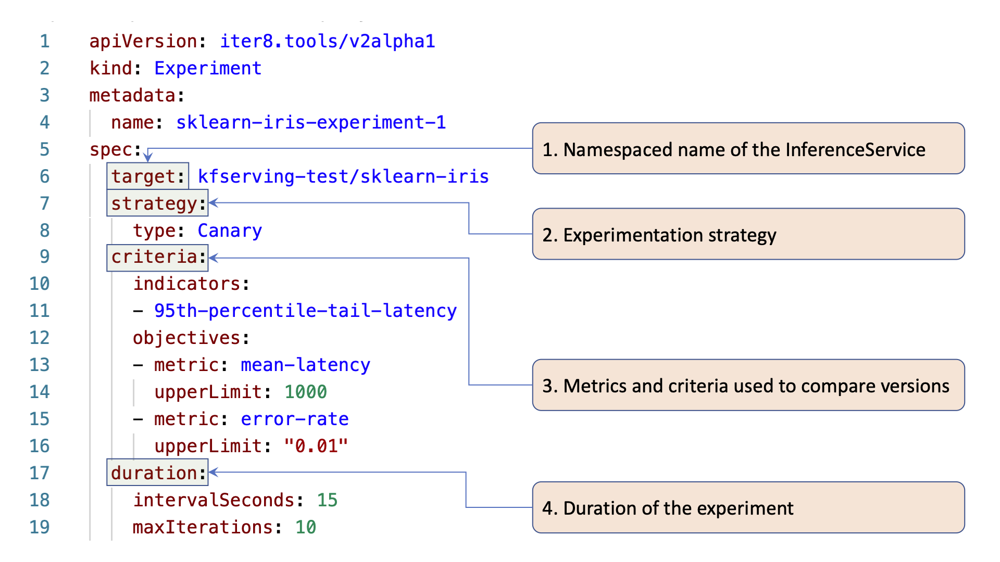

## Anatomy of an iter8 Experiment

> Iter8 defines a Kubernetes resource type called `Experiment`. This means you can create, list, and watch iter8 experiments using the `kubectl` command. 

> Iter8 experiments generally identify a `winning version` (`winner`) based on the experiment criteria. Typically, traffic shifts progressively towards the winner during the experiment, and the winner is promoted at the end.

The following picture illustrates the main elements of an iter8 experiment.

---

### Description of fields highlighted above

**`target`:** InferenceService object used in this experiment. It is specified using the `namespace/name` format.

**`strategy`:** strategy used in this experiment. Currently, iter8-kfserving supports Canary experiments. Other experiment types such as BlueGreen, A/B, and A/B/n rollouts are part of the [roadmap](https://github.com/iter8-tools/iter8-kfserving/wiki/Roadmap).

**`criteria`:** metrics-based criteria used to evaluate the model versions.

**`duration`:** number of iterations of the experiment, along with the duration of each iteration (in seconds).
